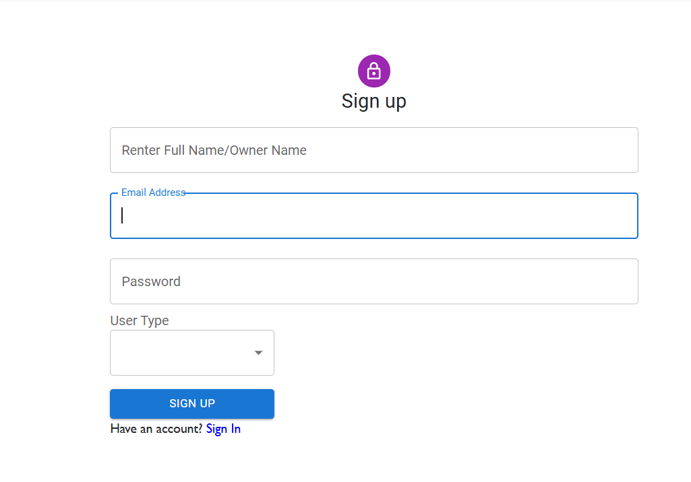
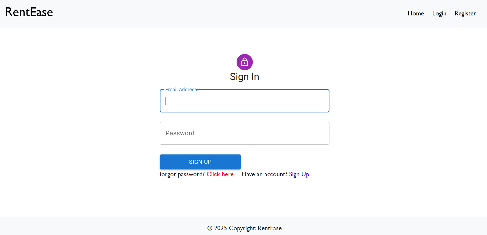
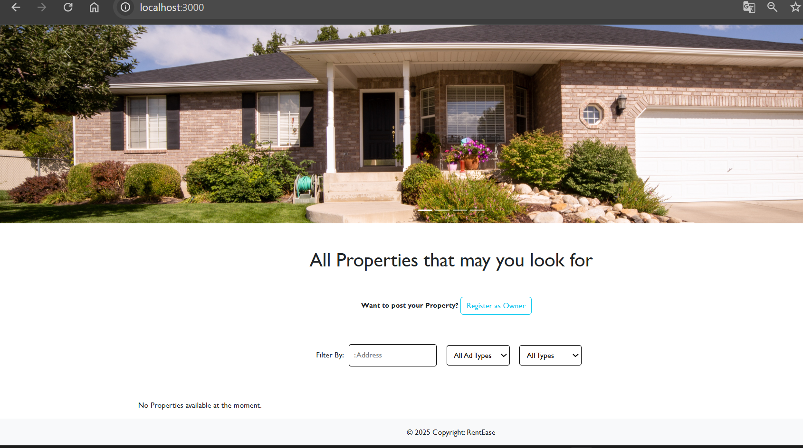

## 🏠 HouseHunt – MERN Stack Rental House Platform

**HouseHunt** is a full-stack rental house application built using the MERN stack. Users can browse available houses for rent with a clean and intuitive interface. The platform is being expanded to allow property owners to upload and manage their listings.

---

## 🚀 Features

### 👤 User

* Register/Login
* Browse available houses
* View house details
* Filter/search (if implemented)

### 🏠 Owner *(Planned)*

* Upload new house listings
* Edit/Delete posted properties

---

## 🛠️ Tech Stack

| Layer    | Technology              |
| -------- | ----------------------- |
| Frontend | React.js + Tailwind CSS |
| Backend  | Node.js + Express.js    |
| Database | MongoDB (Mongoose)      |
| Auth     | JWT + bcrypt            |
| Styling  | Tailwind                |

---

## 📁 Folder Structure

Househunt-project/
├── client/               # React frontend
│   ├── public/
│   └── src/
│       ├── components/
│       ├── pages/
│       └── App.js
├── backend/              # Node.js backend
│   ├── models/
│   ├── routes/
│   ├── controllers/
│   └── server.js
├── Documentation/        # 📄 Docs added here
├── screenshots/          # 📸 UI screenshots
└── README.md


---


## ⚙️ Setup Instructions

### 📦 Prerequisites

* Node.js (v14 or above)
* MongoDB (local or cloud via Atlas)

### 🧩 Installation

```bash
# 1. Clone the repo
git clone https://github.com/your-username/HouseHunt.git

# 2. Install dependencies
cd client
npm install

cd ../backend
npm install
```

### ▶️ Running the App

```bash
# Start frontend
cd client
npm run dev

# Start backend
cd ../backend
npm start
```

---

## 🔌 API Overview

### 👤 User Routes

* `POST /api/users/register`
* `POST /api/users/login`
* `GET /api/houses`
* `GET /api/houses/:id`

### 🏠 Owner Routes *(Planned)*

* `POST /api/houses` (Add new house)
* `PUT /api/houses/:id` (Edit)
* `DELETE /api/houses/:id` (Delete)

---

## 🔐 Authentication

* Passwords are hashed with **bcrypt**
* **JWT** tokens used for authentication and protected routes

---

## 🧪 Testing

* Manual testing via browser frontend
* API tested using **Thunder Client/Postman**

---

## 🎬 Demo

📽️ [Watch Demo Video](https://drive.google.com/file/d/1PSTHk4XCsrLUEQWW5eBxRQPL7uUuVRCk/view?usp=drive_link)

---
## Documentation

You can find all project-related documentation in the [`Documentation/`](./Documentation/) folder.

## Screenshots

| Home Page | Register | Login | Dashboard |
|-----------|----------|--------|------------|
|  |  |  |  |

## 🐞 Known Issues

* Owner house upload feature not yet implemented
* No payment integration
* No mobile app

---

## 🌱 Future Enhancements

* Enable owners to add/manage house listings
* Add Razorpay/Stripe integration
* Map-based house browsing
* City-based and price-based filtering
* Mobile app with React Native

---

## 🧑‍💻 Contributors

* **Pavani** – Frontend & Project Lead
* **Ratnakar** – Backend & Authentication
* **Akash** – UI Design & Routing
* **Krishna** – Database & API Integration

---

## 📂 License

This project was developed as part of the SmartBridge Full Stack Developer MERN Stack Internship Program.
**For educational use only.**
